# 빛의 잔향 개발 리포트

## 1. 게임 개요

`빛의 잔향`은 고대 유적을 배경으로 한 3D 웹 어드벤처 퍼즐 게임이다. 플레이어는 각 스테이지마다 붉은 빛 함정을 피해 `흰 별 기둥` 형태의 GI 기동 장치를 켜고, 그 후 색이 드러난 세 개의 유물을 같은 색 받침대에 배치해야 한다. 총 3개의 스테이지로 구성했으며, 스테이지가 올라갈수록 함정 수와 속도가 증가한다. Stage 1과 Stage 2를 클리어하면 유물 방 앞쪽 문이 열리고, 문 너머의 `통곡의 다리`를 점프로 건너 다음 스테이지로 이동한다.


## 2. 강의 내용과 구현 내용 매핑

### 2.1 실시간 3D 렌더링

강의에서 다룬 실시간 3D 렌더링 구조를 Three.js로 옮겨 보았다. `WebGLRenderer`가 장면을 그리고, `PerspectiveCamera`는 1인칭과 3인칭 시점 전환에 사용했다. 유적의 벽, 바닥, 기둥, 받침대, 유물, 함정, 통곡의 다리는 모두 기본 geometry와 material을 조합해서 만들었다.

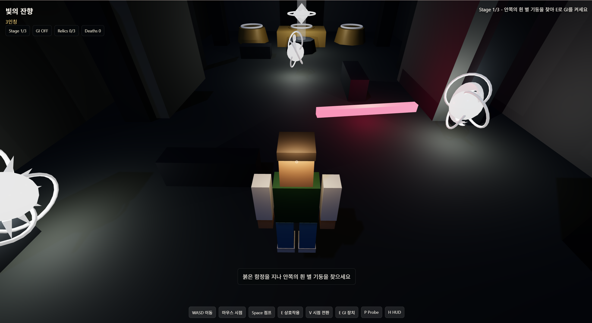

### 2.2 직접광과 그림자

유물과 GI 기동 장치에는 `PointLight`를 사용했고, 전체 유적에는 `DirectionalLight`와 `HemisphereLight`를 배치했다. 플레이어와 오브젝트는 그림자를 생성하거나 받을 수 있도록 설정해, 공간의 깊이와 장애물 위치를 더 쉽게 파악할 수 있게 했다.

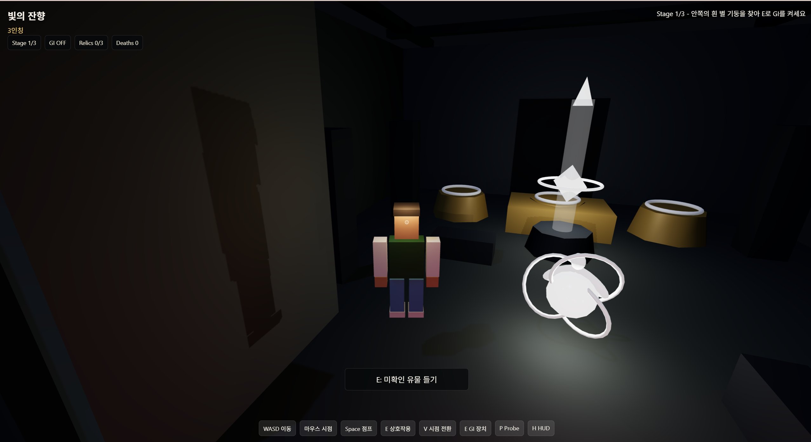

### 2.3 DDGI 스타일 간접광

웹에서 무리 없이 돌아가도록 DDGI의 핵심 아이디어를 probe grid 형태로 단순화해 적용했다. 유적 공간에 여러 probe를 배치하고, 각 probe가 주변 유물 광원의 거리와 색 영향을 누적한다. 그 값을 가까운 바닥, 벽, 기둥 재질의 emissive 성분에 반영해 간접광이 퍼지는 느낌을 만들었다.

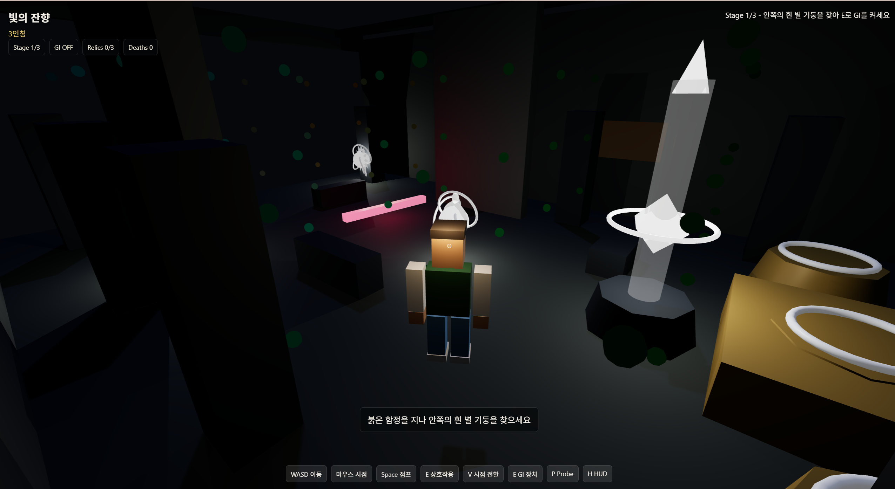

### 2.4 GI 기동 전후 변화

게임 시작 시에는 GI가 꺼져 있어 유물과 받침대가 모두 흰색으로 보인다. 플레이어가 붉은 함정을 피해 흰 별 기둥 GI 장치에 도달해 `E`를 누르면 GI가 켜지고, 그때부터 유물과 받침대의 실제 색이 드러난다. GI를 단순히 보기 좋은 효과로만 두지 않고, 퍼즐을 풀기 위한 조건으로 연결한 부분이다.

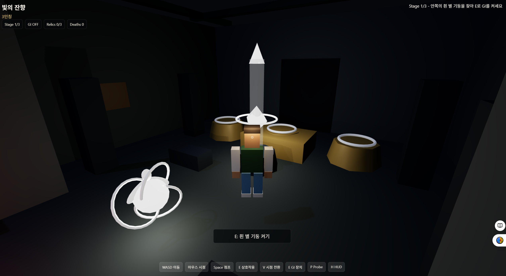

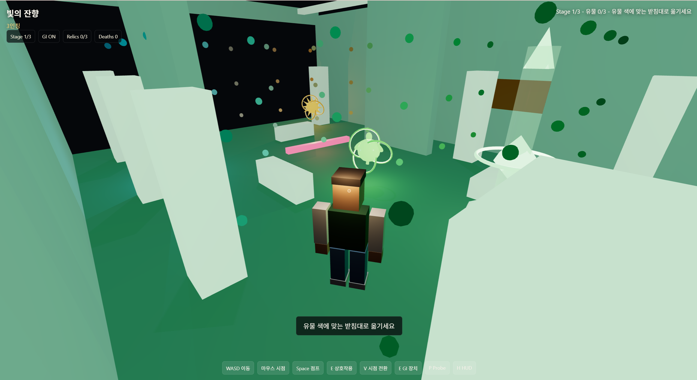

## 3. 게임 내용

### 3.1 기본 조작과 시점 전환

플레이어는 `WASD`로 이동하고 마우스로 시점을 조작한다. `V` 키로 1인칭과 3인칭을 전환할 수 있다. 1인칭은 유물이나 GI 장치를 자세히 확인하기 좋고, 3인칭은 함정, 발판, 플레이어 위치를 파악하기 좋다. `Space` 키는 통곡의 다리에서 점프 이동에 사용한다.

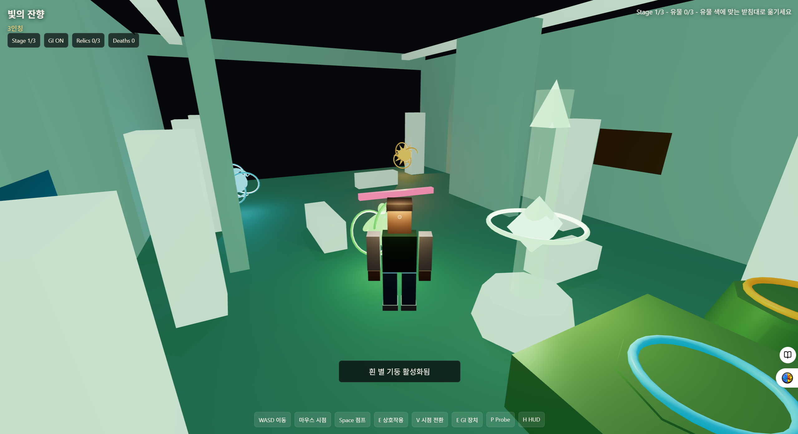

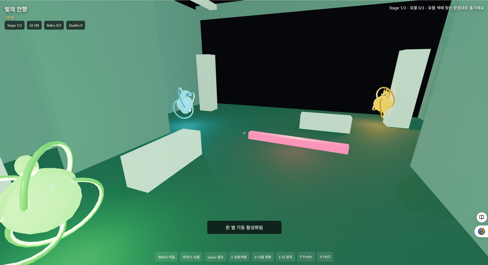

### 3.2 GI 기동 장치

각 스테이지 초반에는 유물과 받침대 색이 숨겨져 있으므로, 플레이어는 먼저 안쪽의 흰 별 기둥을 찾아야 한다. 이 장치는 밝은 흰색 기둥, 회전하는 고리, 떠 있는 별 모양 표식으로 표시해 처음 플레이하는 사람도 목표를 알아볼 수 있게 했다. 장치를 켜면 초록빛으로 변하고, 색 정보가 드러나면서 유물 배치 퍼즐을 진행할 수 있다.

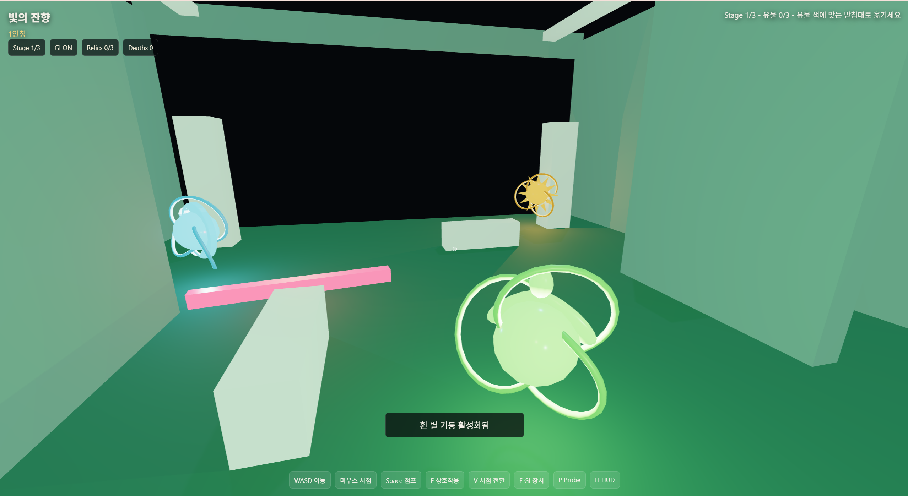

### 3.3 유물 회수와 운반

플레이어는 유물 가까이에서 `E` 키를 눌러 유물을 들 수 있다. 유물을 든 상태에서 다시 `E`를 누르면 내려놓을 수 있으며, GI 기동 후에는 받침대 앞에서 `E`를 눌러 유물을 배치할 수 있다. 유물을 들면 프롬프트가 다음 행동을 안내하도록 구현했다.

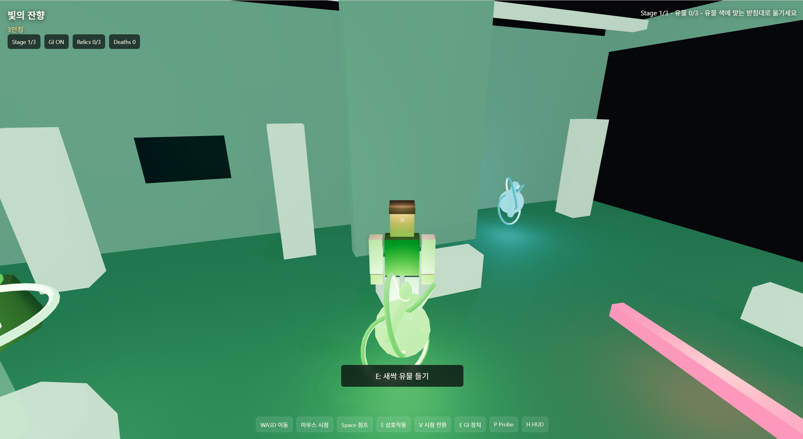

### 3.4 색 맞추기 퍼즐

GI가 켜진 뒤에는 주황, 청록, 초록 유물과 같은 색의 받침대가 드러난다. 유물은 이름에 맞게 태양, 달, 새싹 실루엣을 가지도록 만들었다. 유물을 올바른 받침대에 놓으면 성공 효과음과 안내 메시지가 출력된다. 잘못된 받침대에 놓으면 실패 메시지가 나오며, 플레이어는 유물을 다시 회수해 올바른 위치로 옮겨야 한다.


### 3.5 빛 함정과 실패 처리

각 스테이지에는 붉은 빛 함정이 배치되어 있다. 함정은 스테이지가 올라갈수록 개수가 늘어나고 이동 속도가 빨라진다. 함정에 닿으면 GI가 꺼지고, 현재 들고 있던 유물과 받침대에 놓은 유물이 모두 초기 위치로 돌아가며, 플레이어도 시작 위치로 리스폰된다. 따라서 실패 후에는 다시 흰 별 기둥 GI 장치를 켜는 단계부터 진행해야 한다.

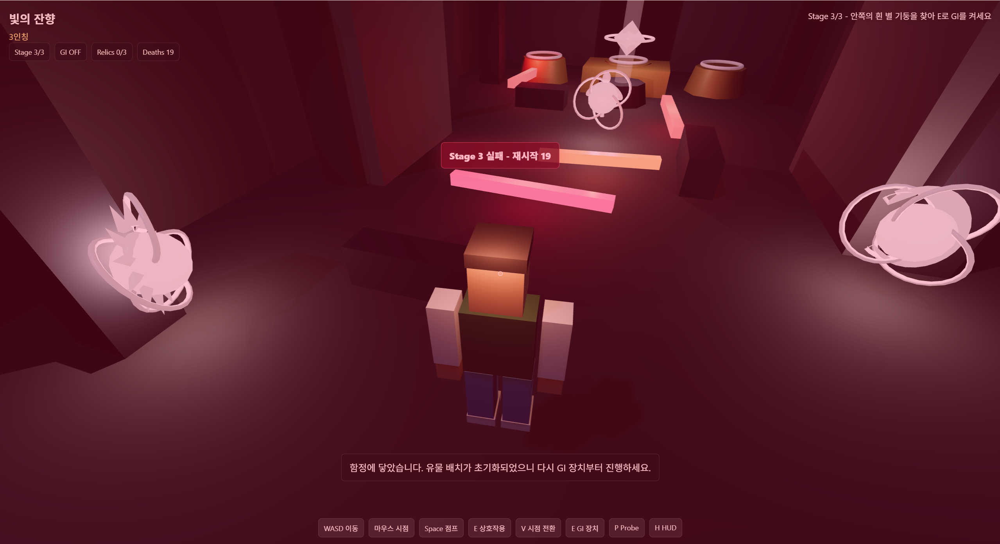

### 3.6 스테이지 구조

게임은 Stage 1, Stage 2, Stage 3으로 구성된다. 각 스테이지는 같은 기본 규칙을 공유하지만, 함정의 개수와 속도가 증가해 난이도가 점진적으로 올라간다. 모든 스테이지에서 GI 기동 장치를 다시 켜야 유물 색을 확인할 수 있도록 구성했다.

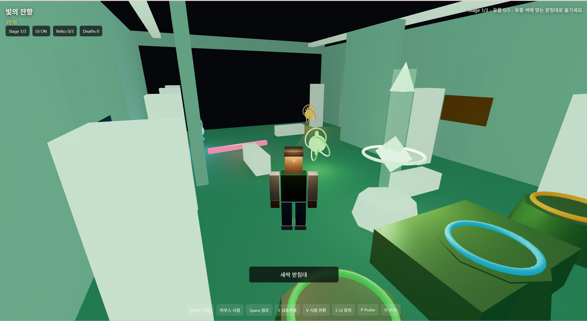

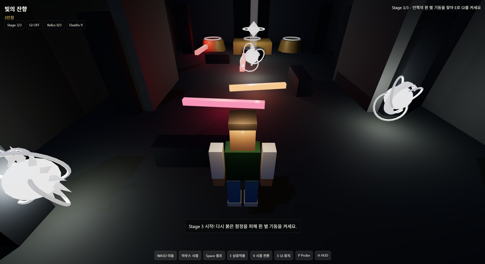

### 3.7 통곡의 다리

Stage 1과 Stage 2에서 세 유물을 모두 올바르게 배치하면 앞쪽 문이 열린다. 문을 통과하면 별도의 통곡의 다리 공간으로 이동하며, 플레이어는 `Space` 키로 발판을 점프해 건너야 한다. Stage 1 이후의 다리는 비교적 넓은 발판으로 구성하고, Stage 2 이후의 다리는 더 좁고 불규칙한 발판으로 구성해 난이도 차이를 만들었다. 발판 밖으로 떨어지면 다리 시작점으로 돌아가고, 끝까지 건너면 금빛 플래시와 입자 효과가 나온 뒤 다음 스테이지로 넘어간다.

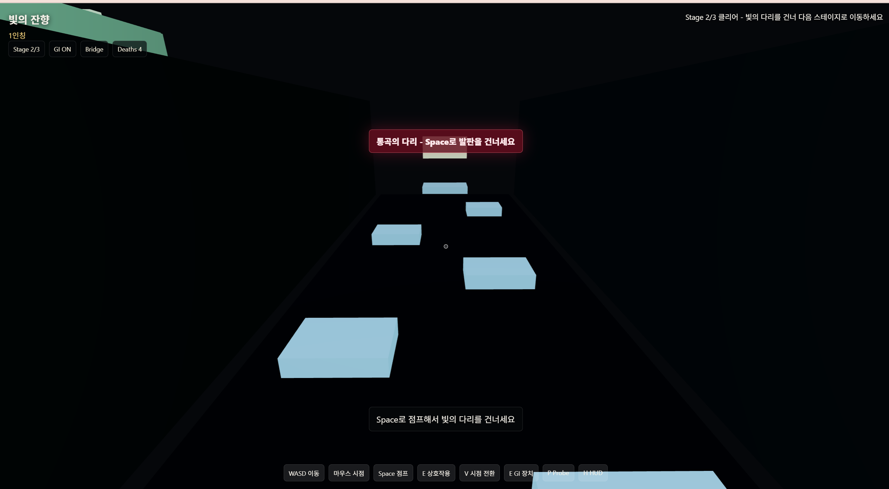

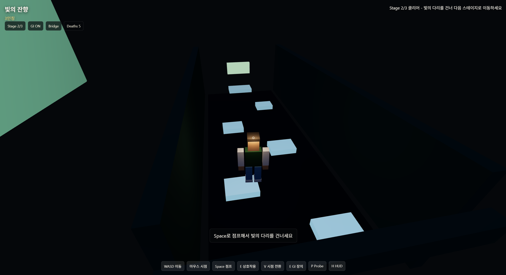

### 3.8 단계별 안내 프롬프트

처음 플레이하는 사람이 다음 행동을 알 수 있도록 단계별 안내 프롬프트를 추가했다. 게임 시작 시에는 흰 별 기둥을 찾으라고 안내하고, GI 기동 후에는 유물 색에 맞게 받침대로 옮기라고 안내한다. 유물 배치 완료 후에는 열린 문으로 이동하라는 메시지를 띄우고, 다리 구간에서는 `Space`로 점프하라고 안내한다.

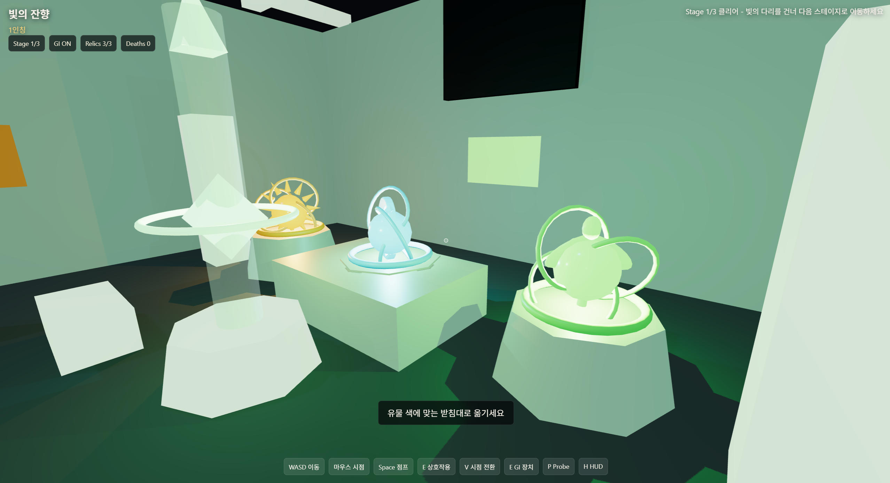

### 3.9 엔딩

Stage 3에서 세 유물을 모두 올바르게 배치하면 마지막 문이 열린다. 플레이어가 열린 문으로 나가면 엔딩 오버레이가 표시되고, 하단 안내 문구를 통해 유적 복원이 완료되었음을 확인할 수 있다.

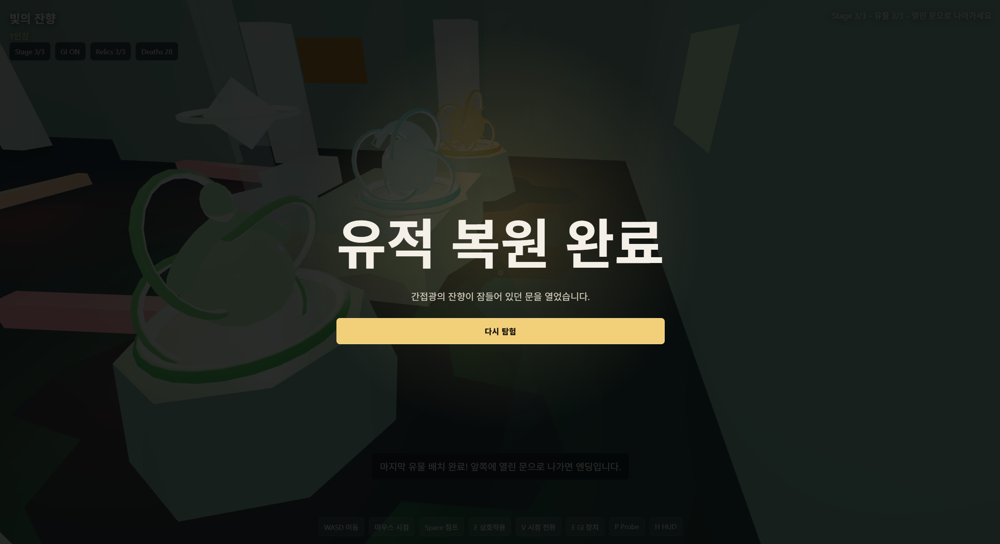

## 4. 개발 상세

### 4.1 파일 구조

프로젝트는 정적 웹 파일만으로 돌아가게 만들었다. `index.html`에는 캔버스와 HUD, 시작/엔딩 오버레이를 두었고, `styles.css`에서는 화면 위에 뜨는 안내 문구와 버튼, 플래시 효과를 정리했다. 실제 게임 로직은 대부분 `src/main.js`에 모았다. 장면 생성, 플레이어 이동, 시점 전환, 스테이지 진행, GI 처리, 함정 판정, 다리 구간, 효과음까지 이 파일에서 관리한다.


### 4.2 플레이어와 카메라

플레이어는 로블록스풍 블록 캐릭터로 만들었다. 3인칭에서는 캐릭터 뒤에서 방 전체와 함정 위치를 볼 수 있고, 1인칭에서는 캐릭터 몸체를 숨겨 시야를 확보했다. 통곡의 다리에서는 3인칭 카메라가 벽에 가려지는 문제가 있어, 다리 구간 전용 카메라 높이와 거리 값을 따로 사용했다.


### 4.3 스테이지 진행 상태

게임 진행은 `stage`, `giEnabled`, `activatedCount`, `bridgeMode`, `deaths` 같은 상태 값으로 관리했다. HUD에는 현재 스테이지, GI 상태, 배치한 유물 수, 실패 횟수가 표시된다. 스테이지를 클리어하거나 다리에 진입할 때, 또는 다음 스테이지로 넘어갈 때 이 값들을 초기화하거나 갱신한다.


### 4.4 DDGI 구현 상세

DDGI probe는 위치, 색, 에너지 값을 가진다. 매 프레임 유물 광원과 probe 사이의 거리를 계산하고, 거리 기반 감쇠를 적용해 probe 색을 갱신한다. 이후 각 오브젝트는 가장 가까운 probe의 색을 받아 emissive 값에 반영한다. `P` 키를 누르면 probe 위치를 시각화할 수 있어, 리포트 캡쳐와 디버깅에 활용할 수 있다.


### 4.5 리포트 캡쳐 지원

리포트에 필요한 장면을 찍기 쉽도록 `P` 키로 probe grid를 켜고 끌 수 있게 했다. `H` 키는 HUD를 숨기는 용도로 넣었다. 덕분에 일반 플레이 화면, GI 비교 화면, probe 시각화 화면을 따로 캡쳐할 수 있었다.

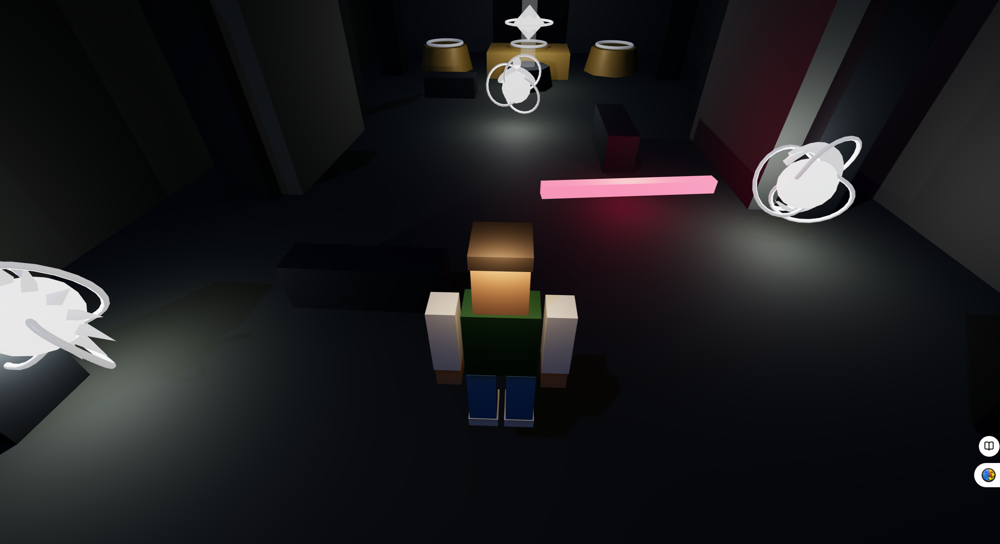

## 5. 실행 방법

게임은 별도의 설치 과정 없이 정적 웹 파일로 실행된다. 로컬에서 확인할 때는 프로젝트 폴더에서 아래 명령을 실행했다.

```bash
python -m http.server 5173
```

이후 브라우저에서 `http://localhost:5173`으로 접속해 플레이를 확인했다. 최종 제출은 교수님께서 바로 접속할 수 있도록 GitHub Pages 배포 링크를 사용한다.

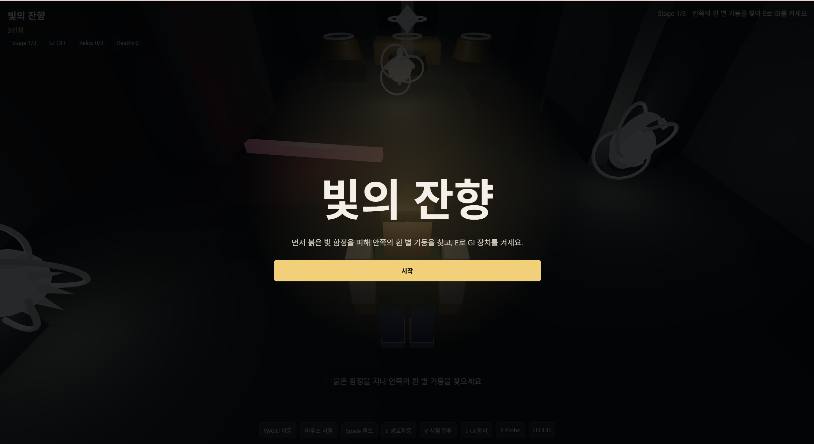

## 6. 제출 링크

- Game 링크: `https://inha030902.github.io/light-ruins-gi/`
- MD 리포트 링크: `https://github.com/inha030902/light-ruins-gi/blob/main/REPORT.md`
